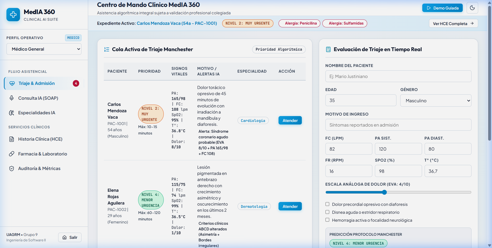
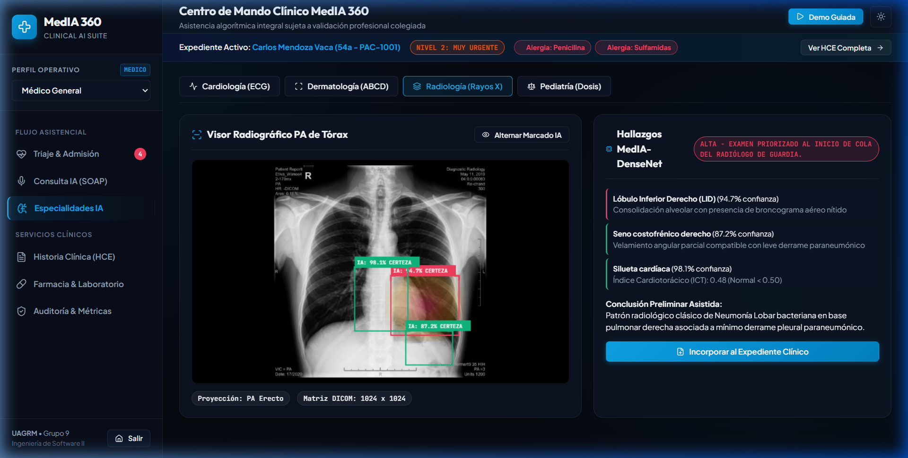
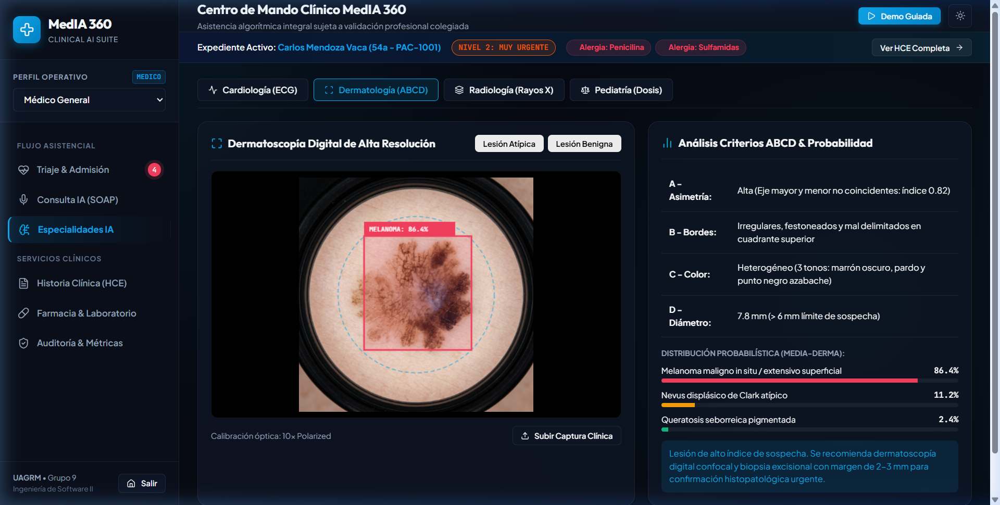

# MedIA 360 — Clínica Digital Inteligente con Asistentes por Especialidad

> **Caso de Estudio 1: Inteligencia Artificial Aplicada a la Salud Digital**  
> **Universidad Autónoma Gabriel René Moreno (UAGRM)** — Facultad Integral de Ciencias de la Computación y Telecomunicaciones (FICCT)  
> **Asignatura:** Ingeniería de Software II (Grupo SB) — **Docente:** Ing. Rolando Antonio Martínez Canedo  
> **Equipo (Grupo Nº 9):** David García Caballero, José Diego García Caballero, Carlos Gabriel Lobo Gutiérrez, Leonardo Serrate Basma, Brandon Líder Vásquez Ardaya.

---

## Documentación Técnica y Académica Completa

Para revisar la especificación formal del sistema bajo metodología RUP/UML y la cobertura de los puntos 3.1.1 a 3.1.8.3.2 del caso de estudio, consulte el documento maestro:

- **[Documento de Especificación y Arquitectura Técnica (DOCUMENTACION_TECNICA.md)](DOCUMENTACION_TECNICA.md)**

### Contenido de la Documentación:
1. **3.1. MedIA360:** Introducción, Ámbito Empresarial, Objetivos Generales y Específicos.
2. **3.1.4 a 3.1.7:** Alcance, Recursos Humanos/Tecnológicos, Presupuesto de Costos y Beneficios de Visión Artificial.
3. **3.1.8:** Infraestructura de Red Hospitalaria (VLANs, Switches 24P, Direccionamiento IP Estático por Salas 1, 2, 3 y Área Administrativa).
4. **3.1.8.1. Captura de Requisitos:**
   - Actores del Sistema (Enfermero/a, Médico General, Radiólogo, Dermatólogo, Farmacéutico, Auditor).
   - Catálogo de Casos de Uso CU-01 a CU-10.
   - Plantillas Detalladas RUP para Casos de Uso Críticos (Triaje Manchester, Consulta SOAP, Radiología Grad-CAM, Dermatología ABCD y Bloqueo Farmacéutico).
   - **Diagrama UML Estructurado de Casos de Uso** (con relaciones `<<include>>` y `<<extend>>`).
5. **3.1.8.2. Análisis:**
   - Identificación de Paquetes (Presentación, Lógica Clínica, Motores de IA, Modelos de Datos).
   - **Diagrama UML de Vista de Paquetes**.
6. **3.1.8.3. Diseño:**
   - **Diagrama de Despliegue Físico y Lógico de la Arquitectura**.
   - **5 Diagramas de Secuencia UML de la Lógica de Negocio** (Triaje, SOAP con IA, Grad-CAM, ABCD y Farmacia).

---

## Descripción General

**MedIA 360** es un prototipo interactivo de alta fidelidad para una clínica digital moderna que integra modelos de Inteligencia Artificial asistencial en todo el flujo de atención médica ambulatoria y de urgencias.

El sistema está diseñado bajo el principio rector de **Human-in-the-loop**: la IA propone diagnósticos, estructura notas clínicas, detecta hallazgos en imágenes y previene errores farmacológicos, pero ninguna decisión clínica ni prescripción adquiere validez legal sin la confirmación y firma explícita del profesional médico colegiado.

---

## Demostración Visual

### Panel de Control y Triaje Manchester (Modo Claro)


### Asistente de Radiología Torácica con Mapa Térmico Grad-CAM
Inferencia sobre radiografías de tórax frontales en formato DICOM sobre canvas con detección de nódulos y consolidaciones bronconeumónicas.


### Asistente Dermatológico con Evaluación de Criterios ABCD
Segmentación perimetral de lesiones cutáneas sobre macrofotografía dermatoscópica con alerta algorítmica de riesgo de melanoma.


---

## 5 Principales Funcionalidades Clínicas

1. **Triaje Inteligente Manchester (5 Niveles):**
   - Clasificación automatizada de urgencia: *Nivel 1 (Resucitación)* a *Nivel 5 (No Urgente)*.
   - Evaluación en tiempo real de signos vitales (PA, FC, FR, SpO2, Temperatura, Escala EVA de dolor) con discriminadores de riesgo y reordenamiento dinámico de la fila de atención.

2. **Consulta Médica con IA Ambiental y Estructuración SOAP:**
   - Captura y transcripción de voz de la conversación clínica entre médico y paciente.
   - Generación instantánea de notas normalizadas bajo el estándar **SOAP** (*Subjetivo, Objetivo, Análisis, Plan*) con codificación CIE-10 y justificación diagnóstica.

3. **Módulo de Especialidades Médicas:**
   - **Cardiología:** Trazo electrocardiográfico (ECG) animado en tiempo real con detección de elevación del segmento ST (SCACEST) y calculadora de riesgo Framingham.
   - **Radiología:** Visualizador de tórax con mapas de calor de activación Grad-CAM.
   - **Dermatología:** Algoritmo ABCD (Asimetría, Bordes, Color, Diámetro) para detección precoz de lesiones malignas.

4. **Farmacia Asistida con Bloqueo de Alergias Cruzadas:**
   - Cruce algorítmico contra antecedentes del expediente clínico.
   - Bloqueo preventivo en tiempo real ante la prescripción de betalactámicos (p. ej., Amoxicilina) en pacientes alérgicos a Penicilina, con recomendación automática de alternativas seguras (macrólidos como Azitromicina).

5. **Auditoría, Trazabilidad y Explicabilidad Clínica:**
   - Registro inmutable de cada inferencia emitida por los modelos, tiempos de latencia y porcentaje de confianza estadística para respaldo médico-legal.

---

## Tecnologías y Arquitectura

- **Frontend:** Vanilla HTML5 semántico, CSS3 moderno (paleta *Deep Obsidian Medical* y *Crisp Surgical Light*, variables CSS reactivas, sin frameworks pesados).
- **Iconografía:** [Lucide Icons](https://lucide.dev/) vectoriales (cero emojis para un estándar médico profesional).
- **Visualizaciones:** Chart.js para telemetría clínica y Canvas 2D interactivo con procesamiento de píxeles para rayos X y ECG.
- **Activos Fotográficos:** Imágenes clínicas fotorrealistas de alta resolución integradas en el pipeline de renderizado.
- **Portabilidad:** Empaquetado universal (`js/bundle.js`) libre de dependencias de backend y sin problemas de CORS.

---

## Instrucciones de Ejecución Local

1. Clona el repositorio:
   ```bash
   git clone https://github.com/DiegoxdGarcia2/Prototipo_MedIA360.git
   cd Prototipo_MedIA360
   ```
2. Ejecuta un servidor local ligero:
   - Con Python:
     ```bash
     python -m http.server 8080
     ```
   - O abre directamente `index.html` en cualquier navegador web moderno (Chrome, Edge, Firefox, Brave, Safari).
3. Accede en tu navegador a:
   ```
   http://localhost:8080/index.html
   ```

---

## Despliegue en GitHub Pages

Para publicar este prototipo en la web gratuitamente:
1. Ve a la pestaña **Settings** de este repositorio en GitHub.
2. En el menú lateral izquierdo, haz clic en **Pages**.
3. En **Build and deployment > Branch**, selecciona la rama `main` y la carpeta `/ (root)`.
4. Haz clic en **Save**. En 1-2 minutos, tu prototipo estará disponible públicamente en:
   `https://DiegoxdGarcia2.github.io/Prototipo_MedIA360/`
