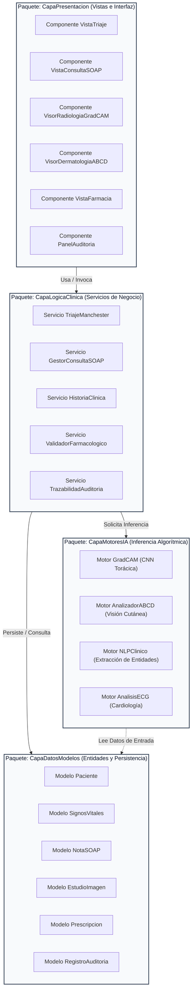
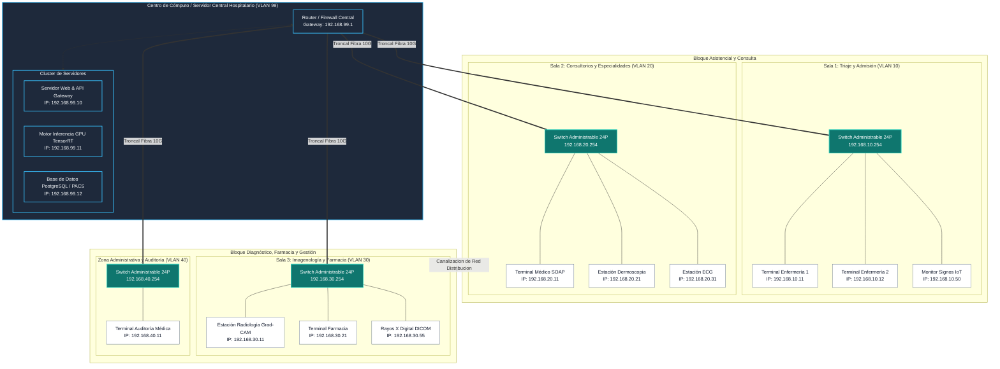
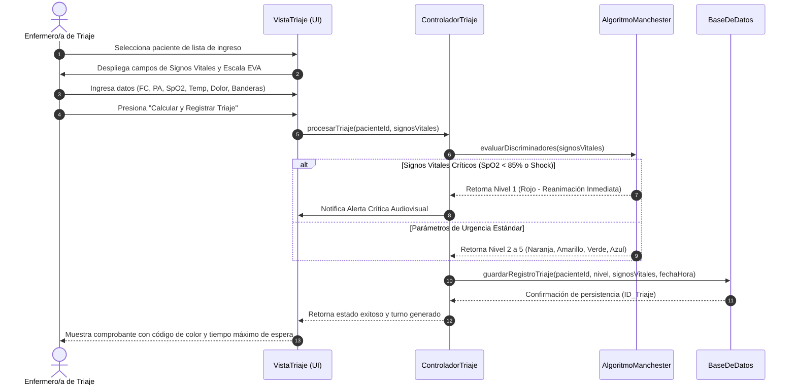
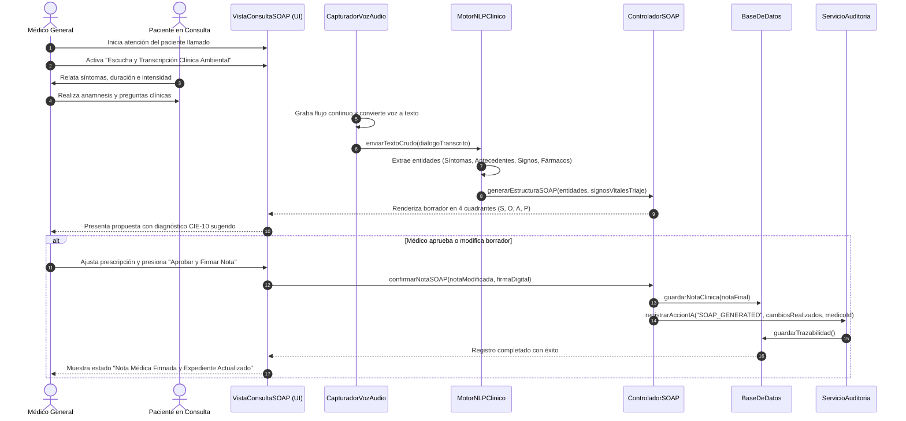
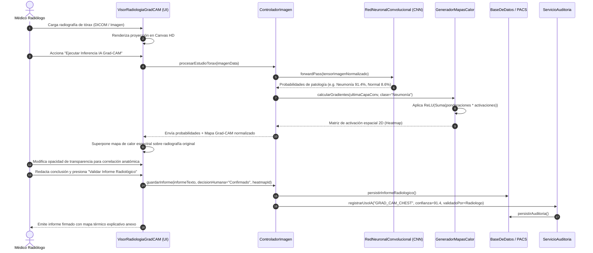
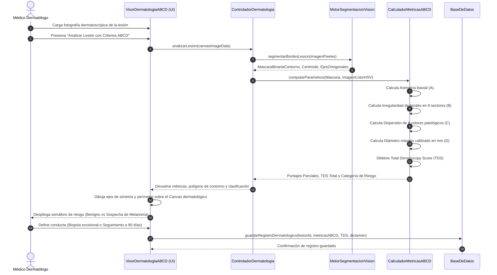
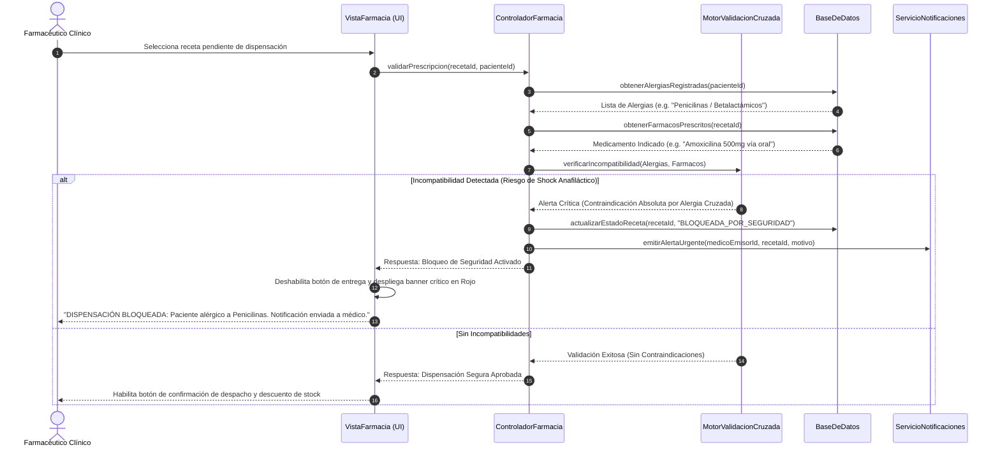

# Documento de Especificación de Software y Arquitectura de Sistema

**Proyecto:** MedIA360 - Plataforma Web Asistida por Inteligencia Artificial para el Diagnóstico y Gestión Clínica  
**Institución:** Universidad Autónoma Gabriel René Moreno (UAGRM)  
**Facultad:** Facultad de Integral del Chaco / Facultad de Ciencias de la Computación y Telecomunicaciones (FICCT)  
**Materia:** Ingeniería de Software II  
**Metodología:** RUP / Modelado Estructurado UML  

---

## 3.1. MedIA360

### 3.1.1. Introducción
El proyecto "MedIA360" consiste en un prototipo de software de alta fidelidad aplicado al sector salud, concebido para transformar la operativa de los centros asistenciales modernos. La plataforma web integra módulos funcionales desarrollados en estándares web modernos (HTML5, CSS3 y JavaScript modular ES6+) para la gestión clínica integral, articulando los procesos de triaje con clasificación de riesgo, expediente clínico electrónico, interconsulta por especialidades, consulta médica estructurada bajo el estándar internacional SOAP (Subjetivo, Objetivo, Análisis, Plan), laboratorio clínico y dispensación farmacéutica.

El núcleo innovador del sistema radica en la incorporación de Inteligencia Artificial aplicada a la visión artificial y el procesamiento de lenguaje natural médico. Esta integración dota al personal de salud de herramientas de asistencia y segunda opinión en tiempo real, mejorando la certidumbre diagnóstica y optimizando los tiempos de respuesta operativa en entornos asistenciales de alta demanda.

### 3.1.2. Ámbito de la Empresa
El ámbito de implementación de "MedIA360" abarca instituciones del sector salud, tales como clínicas privadas, hospitales de segundo y tercer nivel, redes de atención ambulatoria y centros de diagnóstico especializado que buscan digitalizar, modernizar y optimizar sus flujos de trabajo asistencial.

Desde una perspectiva empresarial y funcional, el sistema opera como una solución integral que abarca el ciclo completo de vida del paciente en la institución médica:
1. **Ingreso y Triaje:** Admisión rápida, captura de signos vitales y categorización protocolizada mediante el Sistema de Triaje Manchester para mitigar tiempos de espera críticos.
2. **Atención Médica Estructurada:** Registro ágil de la anamnesis y exploración física mediante transcripción ambiental de voz a texto y estructuración automática de notas clínicas en formato SOAP.
3. **Diagnóstico Asistido por Especialidad:** Integración directa con motores de visión artificial para el apoyo al diagnóstico por imagen en cardiología (electrocardiografía), dermatología y radiología torácica.
4. **Validación Terapéutica y Farmacia:** Cruce algorítmico entre prescripciones emitidas, historial de alergias y fármacos preexistentes, aplicando un bloqueo automático ante contraindicaciones severas.
5. **Auditoría y Supervisión:** Registro inmutable de trazabilidad de cada recomendación provista por la IA, registrando las decisiones de aceptación, modificación o rechazo por parte del médico tratante.

El principal diferenciador competitivo de la plataforma radica en situar a la Inteligencia Artificial como un copiloto explicable, reduciendo el error humano, estandarizando la calidad diagnóstica independientemente del turno o volumen de trabajo, y garantizando la autonomía y supervisión médica en cada etapa del tratamiento.

### 3.1.3. Objetivos

#### 3.1.3.1. Objetivo General
Desarrollar e implementar una plataforma web clínica integral asistida por modelos de Inteligencia Artificial que optimice el diagnóstico médico y la gestión operativa de pacientes, mediante la incorporación de herramientas de visión artificial explicable y estructuración automatizada de datos clínicos.

#### 3.1.3.2. Objetivos Específicos
1. Desplegar un módulo de evaluación dermatológica que analice imágenes de lesiones cutáneas basándose en los criterios clínicos ABCD (Asimetría, Bordes, Color, Diámetro), generando un puntaje paramétrico de sospecha de melanoma.
2. Integrar un módulo de radiología capaz de procesar radiografías de tórax en proyecciones estándar y generar mapas de calor explicativos mediante la técnica Grad-CAM (Gradient-weighted Class Activation Mapping) para sustentar la detección de consolidaciones, cardiomegalia o neumonía.
3. Automatizar y estructurar el flujo de atención del paciente desde el módulo de triaje protocolizado hasta la consulta médica SOAP, facilitando la derivación interdisciplinaria y la emisión segura de órdenes médicas.
4. Desarrollar un mecanismo de validación farmacológica en tiempo real que verifique interacciones medicamentosas y bloquee la dispensación ante alergias documentadas en el expediente del paciente.
5. Mantener un registro seguro, trazable e inmutable de los procesos del sistema mediante un módulo de auditoría dedicado que fiscalice las inferencias de los modelos y las decisiones del profesional de la salud.

### 3.1.4. Alcance
El prototipo de software abarca la construcción completa de la interfaz de usuario web y la arquitectura lógica de cliente-servidor para simular y ejecutar interacciones médicas de alta fidelidad. 

**Límites y Módulos Incluidos:**
- Módulo de Admisión y Triaje con cálculo automático de nivel de urgencia (Niveles I a V del protocolo Manchester) y detección de banderas rojas clínicas.
- Módulo de Consulta Médica con captura simulada de audio ambiental, extracción de entidades médicas (síntomas, signos, antecedentes) y generación de notas SOAP borradoras sujetas a aprobación facultativa.
- Módulo de Asistentes por Especialidad:
  - *Dermatología:* Segmentación interactiva sobre Canvas y análisis métrico de parámetros ABCD.
  - *Radiología:* Visor interactivo de placas torácicas con superposición de gradientes Grad-CAM ajustables en opacidad.
  - *Cardiología:* Monitor animado de derivación electrocardiográfica con detección de arritmias e infarto.
- Módulo de Farmacia con motor de validación cruzada y protocolo de bloqueo de prescripciones.
- Módulo de Auditoría y Trazabilidad con bitácora de eventos y supervisión médica de IA.

**Exclusiones del Alcance Actual:**
- Integración física con equipos de hardware electromédico de radiación ionizante (se utilizan datasets e interfaces DICOM estandarizadas).
- Conexión con pasarelas de pago bancario de seguros médicos privados.

### 3.1.5. Recursos

#### 3.1.5.1. Recursos Humanos
- **Ingeniero de Software Líder / Arquitecto de Software:** Responsable del diseño de la arquitectura del sistema, patrones de diseño de software y orquestación de componentes.
- **Desarrollador Frontend Senior:** Especialista en interfaces web reactivas, manipulación de Canvas 2D/WebGL, accesibilidad clínica y sistemas de diseño en modos claro y oscuro.
- **Ingeniero de Machine Learning / MLOps:** Responsable de la selección, ajuste fino (fine-tuning), cuantización y despliegue de las redes neuronales convolucionales (CNN) de visión artificial y modelos de lenguaje médico (LLM).
- **Especialista en Redes e Infraestructura:** Encargado del diseño de la topología local, direccionamiento IP estático, configuración de switches y segmentación por VLANs.
- **Asesor Clínico / Especialista Médico:** Profesional de la salud encargado de validar los protocolos clínicos (Manchester, criterios dermatológicos ABCD, clasificación de hallazgos radiológicos).

#### 3.1.5.2. Recursos Tecnológicos
- **Estaciones de Trabajo de Desarrollo:** Equipos con procesadores multinúcleo, 16-32 GB de memoria RAM y aceleración por GPU.
- **Entorno de Ejecución Frontend:** Motores de navegación basados en Chromium / Gecko, estándares HTML5, CSS3 y JavaScript ES6+.
- **Bibliotecas y Frameworks:** Motor de iconos vectoriales Lucide, librerías de renderizado gráfico Canvas API, Chart.js para telemetría clínica.
- **Infraestructura de Modelado IA:** Frameworks PyTorch / TensorFlow para el entrenamiento y exportación a formatos ligeros (ONNX / WebGL inference).
- **Herramientas de Control de Versiones:** Git y repositorios centralizados en GitHub para la integración continua del código fuente.

### 3.1.6. Costos por Recurso
A continuación se detalla la estimación económica proyectada para el ciclo de desarrollo y puesta en marcha del prototipo:

| Rubro | Descripción del Recurso | Unidad de Medida | Costo Unitario Estimado (USD) | Costo Total Proyectado (USD) |
| :--- | :--- | :--- | :--- | :--- |
| **Ingeniería de Software** | Desarrollo de submódulos clínicos (Triaje, SOAP, Especialidades, Farmacia) | 320 Horas | $25.00 / hora | $8,000.00 |
| **Ingeniería de IA y MLOps** | Entrenamiento, validación de modelos Grad-CAM y visión ABCD | 160 Horas | $35.00 / hora | $5,600.00 |
| **Consultoría Médica** | Validación de protocolos clínicos y criterios de triaje | 40 Horas | $40.00 / hora | $1,600.00 |
| **Hardware de Red** | 4 Switches administrables de 24 puertos Gigabit Ethernet | 4 Unidades | $450.00 / unidad | $1,800.00 |
| **Servidor de Aplicaciones e IA** | Servidor Rack 2U (GPU dedicada Nvidia RTX para inferencia local) | 1 Servidor | $3,500.00 | $3,500.00 |
| **Cableado Estructurado** | Tendido Cat 6A para Salas 1, 2, 3 y Área Administrativa | 1 Proyecto llave en mano | $1,200.00 | $1,200.00 |
| **Infraestructura Cloud / APIs** | Cuotas computacionales de prueba y almacenamiento de respaldo | Mensual (6 meses) | $150.00 / mes | $900.00 |
| **Total General Estimado** | Inversión total estimada para implementación piloto | - | - | **$22,600.00** |

### 3.1.7. Beneficios para la Organización al Implementar IA Aplicada a Visión Artificial
La incorporación de modelos de visión artificial en el flujo asistencial de MedIA360 proporciona ventajas competitivas y clínicas tangibles:
1. **Estandarización y Soporte de Segunda Opinión:** Proporciona a médicos generales y residentes una segunda opinión algorítmica objetiva, reduciendo la variabilidad interobservador en guardias de alta presión.
2. **Explicabilidad Diagnóstica con Grad-CAM:** La técnica Gradient-weighted Class Activation Mapping calcula el gradiente de la puntuación de la clase patológica con respecto a los mapas de activación de la última capa convolucional. Esto genera mapas térmicos visuales que destacan las regiones anatómicas exactas que determinaron la predicción, evitando el problema de la "caja negra" y elevando la confianza del médico radiólogo.
3. **Cribado Dermatológico Oportuno:** La parametrización matemática de los criterios ABCD (análisis de simetría axial, rugosidad de bordes, dispersión cromática en espacio HSV y diámetro milimétrico) permite clasificar lesiones melanocíticas de forma no invasiva en consultas de atención primaria, derivando oportunamente al especialista antes de que las lesiones evolucionen a fases metastásicas.
4. **Optimización de Tiempos Asistenciales:** La pre-clasificación de estudios radiológicos prioritarios reduce en más de un 60% el tiempo transcurrido entre la toma de la placa y la emisión del informe preliminar en pacientes con neumonía o consolidación aguda.
5. **Mitigación de Errores por Fatiga:** La supervisión computacional constante previene la omisión involuntaria de hallazgos sutiles en placas y dermoscopias realizadas al final de jornadas laborales extensas.

### 3.1.8. Infraestructura Necesaria para Poner en Marcha
Para garantizar una operación ininterrumpida, segura y con baja latencia en la transferencia de imágenes diagnósticas pesadas (DICOM), la plataforma requiere una infraestructura de red de grado hospitalario segmentada lógicamente:

1. **Topología y Segmentación de Red (VLANs):**
   - **VLAN 10 (Sala 1 - Admisión y Triaje):** Destinada a estaciones de captura de datos de pre-ingreso, tensiómetros digitales, termómetros infrarrojos y terminales de enfermería. Direccionamiento: `192.168.10.0/24`.
   - **VLAN 20 (Sala 2 - Consultorios y Especialidades):** Destinada a estaciones de trabajo de médicos generales, dermatólogos y cardiólogos, con prioridad de tráfico para dictado de voz y notas SOAP. Direccionamiento: `192.168.20.0/24`.
   - **VLAN 30 (Sala 3 - Imagenología, Laboratorio y Farmacia):** Red de alto rendimiento para transmisión de archivos DICOM desde equipos de Rayos X al servidor de IA y terminales de dispensación farmacéutica. Direccionamiento: `192.168.30.0/24`.
   - **VLAN 40 (Zona Administrativa y Auditoría):** Terminales de gestión gerencial, reportes de ocupación y supervisión de auditoría médica. Direccionamiento: `192.168.40.0/24`.
   - **VLAN 99 (Gestión y Servidores):** Servidor central de aplicaciones web, base de datos y motor de inferencia GPU. Direccionamiento: `192.168.99.0/24`.

2. **Equipamiento de Conmutación:**
   - Instalación de cuatro (4) **Switches administrables de 24 puertos Gigabit Ethernet (10/100/1000 Mbps)** con soporte para IEEE 802.1Q (VLAN Trunking) y Power over Ethernet (PoE+), ubicados en cada una de las salas operativas para eliminar la congestión de paquetes.
   - Enlace ascendente (Uplink) redundante de fibra óptica de 10 Gbps hacia el bastidor central de servidores (Data Center local).

3. **Asignación de Direcciones IP Estáticas:**
   - Todos los dispositivos biomédicos, terminales clínicas y servidores cuentan con direccionamiento IPv4 estático y reservaciones DHCP basadas en direcciones MAC para asegurar la trazabilidad forense de los accesos.

4. **Servidor Local y Respaldo Cloud:**
   - Servidor local en rack para almacenamiento seguro de historiales clínicos, servidor web NGINX/Node.js y servicio de inferencia de modelos con GPU dedicada.
   - Conexión redundante a enlace troncal de internet para respaldos encriptados en la nube.

---

### 3.1.8.1. Captura de Requisitos

#### 3.1.8.1.1. Actores
A continuación se definen los actores que interactúan directamente con el sistema MedIA360:

1. **Enfermero/a de Triaje:** Profesional encargado del ingreso y clasificación del paciente. Captura signos vitales, evalúa el dolor subjetivo, consulta al recomendador Manchester y asigna la prioridad clínica inicial.
2. **Médico General:** Facultativo de atención primaria. Realiza la consulta estructurada, utiliza el dictado clínico asistido por IA, revisa y aprueba las notas SOAP, prescribe tratamientos y deriva a especialistas.
3. **Médico Radiólogo:** Especialista en imagenología diagnóstica. Analiza placas de tórax, inspecciona los mapas de activación Grad-CAM, valida la sospecha patológica y firma el informe radiológico definitivo.
4. **Médico Dermatólogo:** Especialista en afecciones de la piel. Analiza capturas dermatoscópicas, evalúa los coeficientes de la regla ABCD generados por el algoritmo de visión y determina la necesidad de biopsia.
5. **Farmacéutico Clínico:** Encargado del área de dispensación. Valida las prescripciones emitidas por los médicos, recibe las alertas de contraindicación o alergia y despacha los fármacos aprobados.
6. **Auditor Médico / Administrador:** Encargado de la supervisión de la calidad del servicio, trazabilidad legal y auditoría del uso de los modelos de Inteligencia Artificial en las decisiones clínicas.

#### 3.1.8.1.2. Lista de Casos de Uso
La siguiente matriz cataloga los Casos de Uso estructurados del sistema:

| Identificador | Nombre del Caso de Uso | Actor Primario | Nivel de Prioridad |
| :--- | :--- | :--- | :--- |
| **CU-01** | Realizar Triaje Clínico Manchester y Priorización | Enfermero/a de Triaje | Crítica |
| **CU-02** | Gestionar Consulta Médica Estructurada SOAP con IA | Médico General | Crítica |
| **CU-03** | Analizar Radiografía de Tórax con Explicabilidad Grad-CAM | Médico Radiólogo | Alta |
| **CU-04** | Evaluar Lesión Cutánea con Criterios ABCD | Médico Dermatólogo | Alta |
| **CU-05** | Dispensar Medicación con Bloqueo de Alergias Cruzadas | Farmacéutico Clínico | Crítica |
| **CU-06** | Consultar y Actualizar Historia Clínica Electrónica | Médico General / Especialista | Alta |
| **CU-07** | Monitorizar Trazado Electrocardiográfico en Tiempo Real | Médico General / Cardiólogo | Media |
| **CU-08** | Solicitar y Cargar Estudios de Laboratorio | Médico General / Enfermero/a | Media |
| **CU-09** | Derivar Paciente a Interconsulta de Especialidad | Médico General | Alta |
| **CU-10** | Auditar Sugerencias y Decisiones de Modelos de IA | Auditor Médico / Administrador | Alta |

---

#### 3.1.8.1.3. Detalle de Casos de Uso (Plantillas RUP)

##### Caso de Uso CU-01: Realizar Triaje Clínico Manchester y Priorización
- **Actor Principal:** Enfermero/a de Triaje.
- **Propósito:** Capturar signos vitales de un paciente ingresado, calcular el nivel de urgencia según el algoritmo protocolizado de Manchester y asignar turno asistencial.
- **Precondiciones:** El paciente debe encontrarse registrado en la lista de espera de Admisión y el Enfermero/a debe haber iniciado sesión en el sistema.
- **Flujo Principal:**
  1. El Enfermero/a selecciona al paciente de la lista de espera en la interfaz de Triaje.
  2. El sistema despliega el formulario de captura de parámetros vitales (Presión Arterial Sistólica/Diastólica, Frecuencia Cardíaca, Frecuencia Respiratoria, Saturación de Oxígeno SpO2, Temperatura Corporal y Escala Visual Analógica del Dolor EVA 1-10).
  3. El Enfermero/a ingresa las mediciones obtenidas y selecciona los síntomas guía manifestados.
  4. El sistema ejecuta el algoritmo de Triaje Manchester evaluando discriminadores generales y banderas rojas (e.g. SpO2 < 90%, FC > 120 bpm, dolor torácico opresivo).
  5. El sistema calcula y asigna el nivel de prioridad correspondiente:
     - Nivel 1 (Rojo - Reanimación, atención inmediata).
     - Nivel 2 (Naranja - Muy Urgente, atención en < 10 min).
     - Nivel 3 (Amarillo - Urgente, atención en < 60 min).
     - Nivel 4 (Verde - Poco Urgente, atención en < 120 min).
     - Nivel 5 (Azul - No Urgente, atención en < 240 min).
  6. El Enfermero/a revisa la clasificación sugerida, añade observaciones clínicas y presiona "Confirmar y Guardar Triaje".
  7. El sistema almacena la clasificación en la Historia Clínica y envía al paciente a la cola de espera de Consultorios correspondiente.
- **Flujos Alternos / Excepciones:**
  - *4a. Detección de Parámetros de Riesgo Vital Inmediato (Bandera Roja):* Si el sistema detecta signos de parada inminente, shock o desaturación severa (SpO2 < 85%), emite una alarma audiovisual en pantalla, fuerza la asignación a Nivel 1 (Rojo) y notifica automáticamente al Box de Reanimación / Shockroom.
  - *6a. Ajuste de Criterio por Juicio Clínico del Enfermero:* El Enfermero puede elevar la prioridad asignada si observa signos no cuantificables (e.g. palidez mucocutánea severa), debiendo registrar obligatoriamente la justificación del cambio.
- **Postcondiciones:** El paciente queda categorizado formalmente con color y tiempo máximo de espera, habilitándose su atención en Consulta Médica.

##### Caso de Uso CU-02: Gestionar Consulta Médica Estructurada SOAP con IA
- **Actor Principal:** Médico General.
- **Propósito:** Documentar la consulta del paciente mediante asistencia de audio ambiental y generación automatizada de notas clínicas bajo el esquema internacional SOAP.
- **Precondiciones:** El paciente debe contar con triaje concluido y encontrarse asignado al consultorio del médico en sesión activa.
- **Flujo Principal:**
  1. El Médico selecciona al paciente llamado a consulta desde la lista de espera de consultorio.
  2. El sistema presenta el expediente clínico previo con los signos vitales obtenidos en triaje.
  3. El Médico inicia la interacción verbal con el paciente y activa el botón de "Transcripción y Escucha Clínica Ambiental".
  4. El sistema captura la señal de audio en tiempo real, convierte voz a texto y analiza la semántica del discurso clínico.
  5. El motor de NLP extrae las entidades clínicas y autocompleta los cuatro cuadrantes de la nota SOAP:
     - **S (Subjetivo):** Motivo de consulta cronológico, síntomas relatados por el paciente, duración y antecedentes.
     - **O (Objetivo):** Signos vitales heredados de triaje y hallazgos estructurados del examen físico por sistemas.
     - **A (Análisis):** Diagnósticos diferenciales sugeridos ordenados por probabilidad estadística con códigos CIE-10.
     - **P (Plan):** Esquema terapéutico farmacológico propuesto, solicitud de paraclínicos (imágenes/laboratorio) y recomendaciones higiénico-dietéticas.
  6. El Médico revisa críticamente la propuesta elaborada por la IA, edita o complementa los campos requeridos y prescribe la medicación.
  7. El Médico presiona el botón "Aprobar, Firmar y Guardar Nota SOAP".
  8. El sistema guarda la nota con firma digital médica, registra la auditoría de modificación y emite las órdenes de farmacia y laboratorio correspondientes.
- **Flujos Alternos:**
  - *6a. Rechazo de la Sugerencia de IA:* El Médico puede descartar el borrador generado automáticamente y proceder al llenado manual de los cuatro campos SOAP. El sistema almacena el motivo del descarte en el módulo de auditoría para reentrenamiento del modelo.
- **Postcondiciones:** La nota SOAP queda fijada inmutablemente en el expediente clínico del paciente y se disparan las solicitudes de farmacia y estudios complementarios.

##### Caso de Uso CU-03: Analizar Radiografía de Tórax con Explicabilidad Grad-CAM
- **Actor Principal:** Médico Radiólogo (o Médico General en modalidad consulta).
- **Propósito:** Procesar una radiografía digital de tórax para identificar anomalías pulmonares o cardíacas, visualizando los mapas de activación Grad-CAM que justifican el veredicto de la red neuronal.
- **Precondiciones:** Debe existir un estudio de imagen en formato digital (DICOM o imagen médica calibrada) asociado a la orden del paciente.
- **Flujo Principal:**
  1. El Radiólogo accede al módulo de Radiología de MedIA360 y carga la placa radiográfica del paciente.
  2. El sistema renderiza la imagen original en el visor Canvas de alta definición.
  3. El Radiólogo acciona la función "Ejecutar Inferencia IA con Grad-CAM".
  4. El motor de visión artificial (CNN entrenada en datasets torácicos) procesa la imagen y calcula la distribución de probabilidades de patologías: Neumonía, Consolidación, Infiltrado Basal, Derrame Pleural, Cardiomegalia o Sin Hallazgos Patológicos.
  5. El motor genera la matriz de activación Grad-CAM a partir de los gradientes de la última capa convolucional.
  6. El sistema proyecta sobre el Canvas el mapa de calor superpuesto con escala espectral (rojo para máxima activación/sospecha, azul para tejido de baja relevancia diagnóstica).
  7. El Radiólogo ajusta el control deslizante de opacidad de Grad-CAM para contrastar el mapa térmico contra las densidades óseas y parénquima pulmonar de la placa original.
  8. El sistema reporta el índice de confianza porcentual y la región anatómica comprometida.
  9. El Radiólogo redacta la conclusión diagnóstica, confirma o desestima los hallazgos de la IA y firma el informe radiológico.
- **Flujos Alternos:**
  - *4a. Calidad de Imagen Deficiente:* Si la placa presenta artefactos por movimiento o resolución inadecuada, el sistema alerta al usuario recomendando la repetición del disparo radiológico antes de emitir un dictamen.
- **Postcondiciones:** El informe radiológico con el mapa Grad-CAM indexado queda disponible en el expediente clínico del paciente.

##### Caso de Uso CU-04: Evaluar Lesión Cutánea con Criterios ABCD
- **Actor Principal:** Médico Dermatólogo.
- **Propósito:** Evaluar macroscópica y dermatoscópicamente una lesión pigmentada de la piel, calculando automáticamente los índices de Asimetría, Bordes, Color y Diámetro para el cribado temprano de melanoma.
- **Precondiciones:** La imagen de dermatoscopia debe estar cargada en el visor dermatológico del paciente.
- **Flujo Principal:**
  1. El Dermatólogo carga la fotografía dermatoscópica de la lesión cutánea en el módulo de Dermatología.
  2. El sistema aplica algoritmos de segmentación para delimitar el contorno de la lesión frente a la piel circundante.
  3. El sistema computa individualmente los cuatro parámetros de la regla clásica ABCD:
     - **A (Asimetría):** División en ejes biaxiales ortogonales y cálculo del porcentaje de superposición geométrica (Simétrica, Asimétrica en 1 eje, Asimétrica en 2 ejes).
     - **B (Bordes):** Medición de la irregularidad perimetral, escotaduras y terminaciones abruptas en 8 cuadrantes (0 a 8 puntos).
     - **C (Color):** Análisis espectral del número de tonalidades presentes (marrón claro, marrón oscuro, negro, rojo, blanco, azul-grisáceo).
     - **D (Diámetro):** Estimación milimétrica del eje mayor de la lesión referenciado contra la escala microscópica calibrada.
  4. El sistema calcula el Total Dermoscopy Score (TDS) combinando los pesos ponderados clínicos: `TDS = (Asimetría * 1.3) + (Bordes * 0.1) + (Color * 0.5) + (Diámetro * 0.5)`.
  5. El sistema clasifica el nivel de riesgo:
     - Benigno (TDS < 4.75).
     - Lesión Sospechosa / Atípica (TDS entre 4.75 y 5.45).
     - Alta Sospecha de Melanoma Maligno (TDS > 5.45).
  6. El sistema dibuja sobre el Canvas los ejes de asimetría y el mapa de segmentación perimetral.
  7. El Dermatólogo examina las métricas, consigna la conducta terapéutica (control evolutivo vs extirpación con biopsia) y registra la nota de evolución.
- **Postcondiciones:** Los índices paramétricos y la imagen segmentada quedan incorporados en el expediente dermatológico del paciente.

##### Caso de Uso CU-05: Dispensar Medicación con Bloqueo de Alergias Cruzadas
- **Actor Principal:** Farmacéutico Clínico.
- **Propósito:** Validar la orden de dispensación emitida en la consulta médica contra el perfil alérgico y antecedentes del paciente, bloqueando la entrega de fármacos de riesgo.
- **Precondiciones:** Debe existir una prescripción médica activa generada desde el módulo de Consulta SOAP.
- **Flujo Principal:**
  1. El Farmacéutico abre el módulo de Farmacia y consulta las recetas pendientes de despacho.
  2. Selecciona la prescripción médica asociada al paciente.
  3. El sistema ejecuta el servicio de validación cruzada farmacológica, contrastando los principios activos indicados con la lista de alergias severas registradas en la Historia Clínica del paciente.
  4. Si no se detectan incompatibilidades ni alergias cruzadas (e.g. Alergia a Penicilinas frente a prescripción de Amoxicilina o Cefalosporinas de 1ra generación), el sistema despliega el indicador de "Aprobación de Seguridad Farmacológica: Sin Alertas".
  5. El Farmacéutico registra los lotes de los medicamentos, descuenta el stock de inventario y confirma la dispensación al paciente.
- **Flujos Alternos / Excepciones:**
  - *3a. Detección de Contraindicación Severa / Alergia Cruzada:*
    1. El sistema intercepta una coincidencia entre la prescripción y el registro alérgico del paciente (e.g. Paciente con Alergia a Penicilina recibiendo indicación de Amoxicilina / Ácido Clavulánico).
    2. El sistema **bloquea inmediatamente la opción de dispensación** y genera una notificación visual de advertencia crítica en rojo: "BLOQUEO DE SEGURIDAD FARMACOLÓGICA: Alto riesgo de choque anafiláctico / hipersensibilidad cruzada".
    3. El sistema inhabilita la confirmación de entrega y emite una solicitud urgente de re-evaluación médica dirigida al facultativo emisor.
    4. El Farmacéutico registra la incidencia en la bitácora y retiene la entrega del fármaco hasta que el médico ajuste la receta por un principio activo alternativo seguro (e.g. Azitromicina o Macrólidos).
- **Postcondiciones:** Se evita el evento adverso farmacológico y se actualiza el estado de la receta a "Dispensada" o "Bloqueada por Seguridad".

---

#### 3.1.8.1.4. Estructurar Casos de Uso (Diagrama UML)

```mermaid
flowchart TD
    %% Definición de Actores
    subgraph Actores ["Personal y Actores del Sistema"]
        Enfermero["fa:fa-user-nurse Enfermero/a de Triaje"]
        Medico["fa:fa-user-md Médico General"]
        Radiologo["fa:fa-x-ray Médico Radiólogo"]
        Dermatologo["fa:fa-microscope Médico Dermatólogo"]
        Farmaceutico["fa:fa-pills Farmacéutico Clínico"]
        Auditor["fa:fa-user-shield Auditor Médico / Admin"]
    end

    %% Límite del Sistema
    subgraph SistemaMedIA360 ["Sistema MedIA360 - Plataforma Clínica con IA"]
        %% Casos de Uso
        CU01(["CU-01: Realizar Triaje Clínico Manchester"])
        CU02(["CU-02: Gestionar Consulta Estructurada SOAP"])
        CU03(["CU-03: Analizar Radiografía de Tórax Grad-CAM"])
        CU04(["CU-04: Evaluar Lesión Cutánea ABCD"])
        CU05(["CU-05: Dispensar Medicación con Bloqueo"])
        CU06(["CU-06: Consultar Historia Clínica"])
        CU07(["CU-07: Monitorizar Trazado ECG"])
        CU08(["CU-08: Solicitar Estudios Paraclínicos"])
        CU09(["CU-09: Derivar a Especialidad"])
        CU10(["CU-10: Auditar Decisiones de IA"])

        %% Casos de Uso Inlcuidos / Extendidos
        CU_Auth(["CU-Autenticar Credenciales y Colegiatura"]):::systemUC
        CU_AlertaRoja(["CU-Disparar Alerta Roja / Shockroom"]):::extendUC
        CU_BloqueoFarmaco(["CU-Bloquear Prescripción por Alergia"]):::extendUC
        CU_LogAuditoria(["CU-Registrar Trazabilidad e Inferencia IA"]):::includeUC
    end

    %% Relaciones de Actores con Casos de Uso
    Enfermero --> CU01
    Enfermero --> CU06
    Medico --> CU02
    Medico --> CU06
    Medico --> CU07
    Medico --> CU08
    Medico --> CU09
    Radiologo --> CU03
    Dermatologo --> CU04
    Farmaceutico --> CU05
    Auditor --> CU10

    %% Relaciones <<include>>
    CU01 -.->|<<include>>| CU_Auth
    CU02 -.->|<<include>>| CU_Auth
    CU03 -.->|<<include>>| CU_Auth
    CU04 -.->|<<include>>| CU_Auth
    CU05 -.->|<<include>>| CU_Auth
    CU02 -.->|<<include>>| CU_LogAuditoria
    CU03 -.->|<<include>>| CU_LogAuditoria
    CU04 -.->|<<include>>| CU_LogAuditoria

    %% Relaciones <<extend>>
    CU_AlertaRoja -.->|<<extend>>| CU01
    CU_BloqueoFarmaco -.->|<<extend>>| CU05
    CU09 -.->|<<extend>>| CU02

    classDef systemUC fill:#e0f2fe,stroke:#0369a1,stroke-width:2px,color:#0f172a;
    classDef includeUC fill:#ecfdf5,stroke:#059669,stroke-width:2px,color:#0f172a;
    classDef extendUC fill:#fef2f2,stroke:#dc2626,stroke-width:2px,color:#0f172a;
```

El siguiente diagrama UML modela la interacción entre los diferentes actores clínicos y los casos de uso del sistema MedIA360, denotando las relaciones de inclusión obligatoria (`<<include>>`) y de extensión condicionada (`<<extend>>`):

---

### 3.1.8.2. Análisis

#### 3.1.8.2.1. Identificación de Paquetes
Para garantizar una arquitectura escalable, mantenible y con bajo acoplamiento, el sistema MedIA360 se divide en cuatro subsistemas o capas organizadas en paquetes de software:

1. **Paquete `CapaPresentacion` (UI / Vistas de Usuario):**
   - Agrupa los componentes visuales de interacción con los profesionales de salud.
   - Contiene los submódulos: `VistaTriaje`, `VistaConsultaSOAP`, `VisorRadiologiaGradCAM`, `VisorDermatologiaABCD`, `VistaFarmacia`, `VistaCardiologiaECG` y `PanelAuditoria`.
   - Responsable de la manipulación del DOM, captura de eventos de usuario, controles interactivos sobre Canvas y visualización adaptable (Dark/Light mode).

2. **Paquete `CapaLogicaClinica` (Controladores y Servicios Clínicos):**
   - Aloja las reglas de negocio médico, orquestación de flujos y validaciones formales.
   - Contiene: `ControladorTriaje` (motor de priorización Manchester), `ControladorSOAP` (estructuración de anamnesis), `GestorHistoriaClinica` (expediente unificado), `ValidadorFarmacologico` (cruce de incompatibilidades y contraindicaciones) y `ServicioAuditoria` (registro de trazabilidad).

3. **Paquete `CapaMotoresIA` (Servicios de Inferencia e Inteligencia Artificial):**
   - Agrupa los servicios de computación algorítmica e inferencia de modelos neuronales.
   - Contiene: `MotorGradCAM` (cálculo de gradientes sobre mapas convolucionales torácicos), `MotorDermatologicoABCD` (segmentación y análisis de asimetría, bordes, color y diámetro), `MotorNLPClinico` (reconocimiento de entidades médicas y estructuración SOAP) y `DetectorECG` (análisis de ondas P-QRS-T y arritmias).

4. **Paquete `CapaDatosModelos` (Persistencia y Entidades de Dominio):**
   - Modela las entidades de negocio persistentes y las interfaces de acceso a almacenamiento.
   - Contiene los modelos: `Paciente`, `SignosVitales`, `NotaSOAP`, `EstudioRadiologico`, `LesionDermatologica`, `PrescripcionMedicamento`, `RegistroAuditoria` y el adaptador de base de datos / almacenamiento local.

---

#### 3.1.8.2.2. Vista de Paquetes (Diagrama UML)
El siguiente diagrama UML de paquetes exhibe la jerarquía de dependencias unívocas entre capas, garantizando que la capa de presentación desconozca los detalles internos de cálculo de la IA y que los modelos de datos permanezcan desacoplados de la interfaz:

---

### 3.1.8.3. Diseño

#### 3.1.8.3.1. Diseño de la Arquitectura (Diagrama de Despliegue Físico y Lógico)
El diseño arquitectónico de MedIA360 se estructura en un modelo cliente-servidor distribuido sobre una red de área local (LAN) hospitalaria de alta velocidad, garantizando la segmentación por salas operativas mediante switches administrables de 24 puertos y asignación de direcciones IP estáticas:

---

#### 3.1.8.3.2. Diseño de la Lógica de Negocio (Diagramas de Secuencia UML)

##### 1. Diagrama de Secuencia: Flujo de Triaje Clínico Manchester y Priorización
El siguiente diagrama describe el proceso de clasificación de urgencia, desde la captura de signos vitales hasta la emisión del turno de atención con detección de banderas rojas:

---

##### 2. Diagrama de Secuencia: Flujo de Consulta Médica Estructurada SOAP con Asistencia IA
El siguiente diagrama detalla la captura de audio ambiental, procesamiento del lenguaje clínico y aprobación médica de las notas SOAP:

---

##### 3. Diagrama de Secuencia: Flujo de Diagnóstico Radiológico con Explicabilidad Grad-CAM
El siguiente diagrama ilustra la inferencia visual sobre placas de tórax y la generación de mapas de calor para auditoría del especialista:

---

##### 4. Diagrama de Secuencia: Flujo de Cribado Dermatológico con Criterios ABCD
El siguiente diagrama exhibe la segmentación geométrica y paramétrica de lesiones pigmentadas de la piel:

---

##### 5. Diagrama de Secuencia: Flujo de Farmacia con Bloqueo Activo por Alergias Cruzadas
El siguiente diagrama detalla la intercepción de seguridad farmacéutica ante la detección de riesgo de hipersensibilidad alérgica:

---

## 3.2. Conclusión del Documento de Especificación
La presente especificación técnica y de arquitectura de **MedIA360** responde a los más altos estándares metodológicos de la Ingeniería de Software moderna. La segmentación de requisitos mediante casos de uso formales, la clara separación modular en paquetes desacoplados y la visualización de despliegue físico por salas y VLANs garantizan que la incorporación de Inteligencia Artificial se ejecute de manera armónica, auditable y segura en beneficio directo de la salud de los pacientes.
